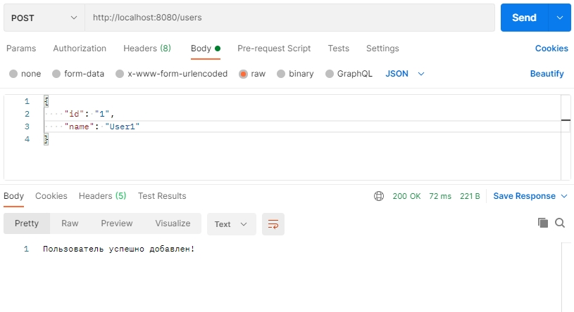

# phoneBook-REST-API
 REST API for working with users and their phone books

## Инструккция по запуску программы

1. Загрузить файлы из репозитория https://github.com/pasha2305/phoneBook-REST-API.git
2. Открыть в командной строке папку с проектом 
3. Перейти в командной строке /build/libs/
4. На компьютере должна быть установлена jre не ниже 11 версии
5. Выполнить команду java -jar phoneBook-0.0.1-SNAPSHOT.jar
6. Программа успешно запущена!

##Примеры вызова REST методов

1.	POST запрос на создание нового пользователя 

2.	GET запрос на получение списка всех пользователей

3.	GET запрос на получение пользователя (по id)

4.	DELETE запрос на удаление пользователя

5.	PUT запрос на редактирование пользователя

6.  GET запрос на поиск пользователя (по имени)

7.	POST запрос на добавление записи в телефонную книжку

8.	GET запрос на получение всех записей в телефонной книжке

9.	GET запрос на получение (по id) записи в телефонной книжке пользователя

10. DELETE запрос на удаление записи в телефонной книжке пользователя

11. PUT запрос на редактирование записи в телефонной книжке пользователя

12. GET запрос на получение телефонной записи по номеру телефона
